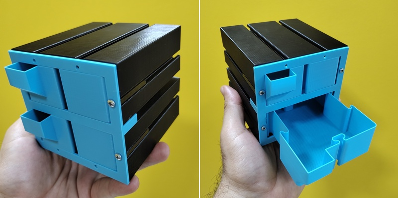
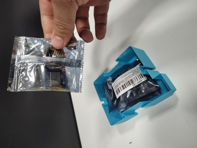
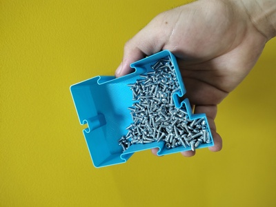
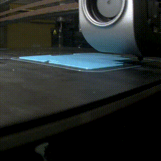

# decaBox 3D Organizer

My solution for small 3D printed drawers and organizers using less filament. My first inspuration was the Fast-Printing Modular Drawer System (Vase Mode) from @LR3DUK (https://www.printables.com/model/139570-fast-printing-modular-drawer-system-vase-mode), but I made an entirelly new design to improve size, resistance, and beauty.

## decaBox is fast!

With most parts using the *vase mode* print (with a 0.6 nozzle set with line width 0.8), where each structure is made with a single pass, you have your drawers faster than any project. Robustness is guaranteed by the creases in the pieces.

## decaBox saves money!

You can have a drawer using 20 grams of filament. A complete set uses around 130 grams! You can build 7 complete organizers with a single 1Kg filament. 

## decaBox is versatile!

The same body can use 2 drawers horizontally or vertically, or a single big drawer. And you can attach as many organizers you need using the double connectors. 

- Drawer can hold default component packages and boards.

- You can remove the drawer and use the handle to pour components, like screws.

- Vase mode allows fast printing, and save lots of filament! Each drawer uses only 22 grams!

